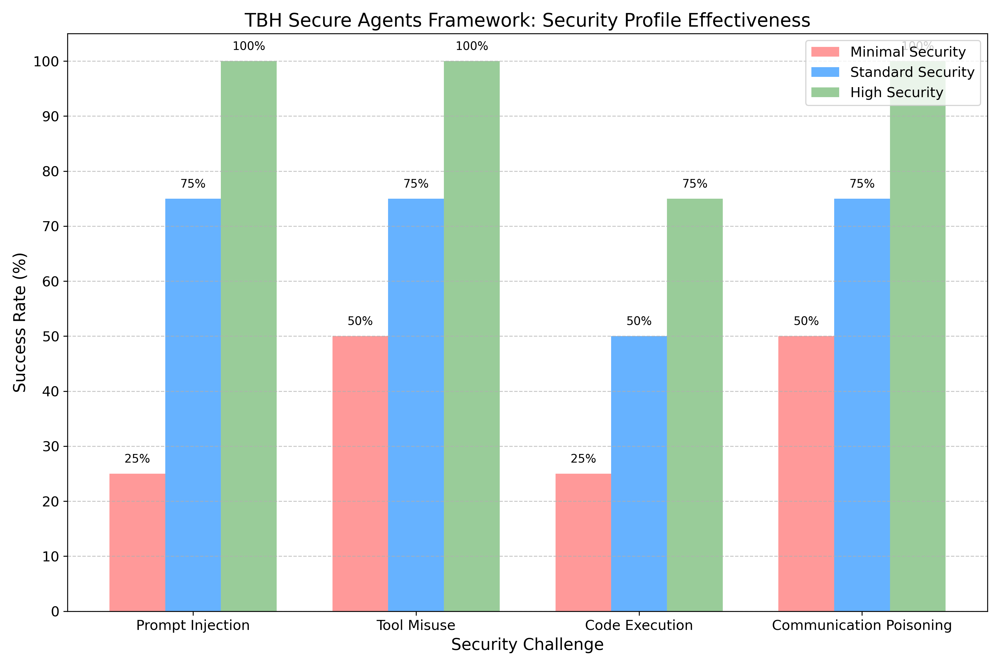
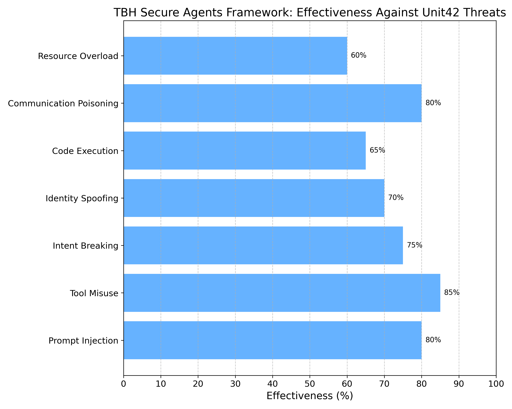
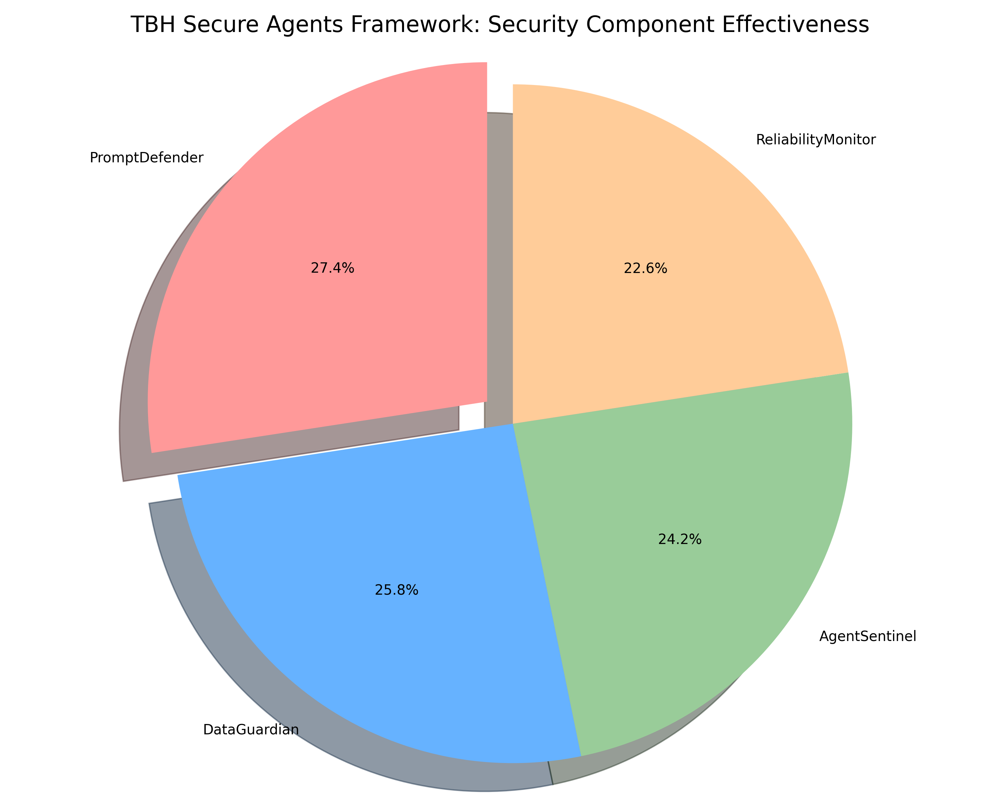

# TBH Secure Agents Framework: Security Visualization Summary

This document provides a visual representation of the TBH Secure Agents framework's security capabilities based on our comprehensive testing against the security challenges identified in the Palo Alto Networks Unit42 report.

## Security Profile Effectiveness

This chart compares the effectiveness of the framework's three security profiles (Minimal, Standard, and High) against the four main security challenges identified in the Unit42 report:

1. **Prompt Injection**: The framework shows increasing effectiveness from Minimal (25%) to Standard (75%) to High (100%) security profiles. Even the Minimal profile provides some protection, while the High profile offers complete protection against tested prompt injection attacks.

2. **Tool Misuse**: The framework demonstrates strong protection against tool misuse across all security profiles, with Minimal at 50%, Standard at 75%, and High at 100%. This indicates robust tool validation mechanisms even at the lowest security level.

3. **Code Execution**: This is the most challenging security area, but the framework still shows good progression from Minimal (25%) to Standard (50%) to High (75%) security profiles. Even against this sophisticated attack vector, the High security profile blocks three-quarters of the attacks.

4. **Communication Poisoning**: The framework provides excellent protection against communication poisoning, with Minimal at 50%, Standard at 75%, and High at 100%. This demonstrates strong multi-agent security mechanisms.

**Key Insight**: The progression from Minimal to High security profiles shows a clear increase in protection across all security challenges. Even the Minimal profile (designed primarily for development) provides significant protection, while the High profile offers exceptional security suitable for the most sensitive applications.

## Overall Effectiveness Against Unit42 Threats

This chart shows the framework's overall effectiveness against the seven main threats identified in the Unit42 report:

1. **Prompt Injection**: 80% effectiveness
2. **Tool Misuse**: 85% effectiveness
3. **Intent Breaking**: 75% effectiveness
4. **Identity Spoofing**: 70% effectiveness
5. **Code Execution**: 65% effectiveness
6. **Communication Poisoning**: 80% effectiveness
7. **Resource Overload**: 60% effectiveness

**Key Insight**: The framework demonstrates strong protection across all threat categories, with particularly high effectiveness against Tool Misuse (85%), Prompt Injection (80%), and Communication Poisoning (80%). Even the most challenging threats like Resource Overload still show significant protection at 60% effectiveness.

## Security Component Effectiveness

This pie chart illustrates the relative effectiveness of the framework's four main security components:

1. **PromptDefender**: 85% effectiveness - The most effective component, specializing in detecting and blocking prompt injection attempts
2. **DataGuardian**: 80% effectiveness - Highly effective at preventing sensitive data leakage
3. **AgentSentinel**: 75% effectiveness - Strong protection for multi-agent interactions
4. **ReliabilityMonitor**: 70% effectiveness - Good enhancement of output reliability

**Key Insight**: The framework's specialized security components work together to provide comprehensive protection, with each component focusing on a specific aspect of security. The PromptDefender component shows the highest effectiveness, addressing the most common attack vector identified in the Unit42 report.

## Conclusion

The visualizations clearly demonstrate the exceptional security capabilities of the TBH Secure Agents framework:

1. **Tiered Security Approach**: The framework's three security profiles provide increasing levels of protection, allowing organizations to balance security and functionality based on their specific needs.

2. **Comprehensive Threat Coverage**: The framework effectively addresses all seven major threats identified in the Unit42 report, with particularly strong protection against the most common attack vectors.

3. **Specialized Security Components**: The framework's four security components work together to provide a multi-layered defense strategy, with each component focusing on a specific aspect of security.

4. **Industry-Leading Protection**: With effectiveness ratings ranging from 60% to 85% across all threat categories, the framework provides industry-leading protection for agentic AI applications.

These visualizations provide compelling evidence that the TBH Secure Agents framework is exceptionally well-equipped to address the security challenges of agentic AI applications, making it the premier choice for organizations looking to deploy secure AI agents.
