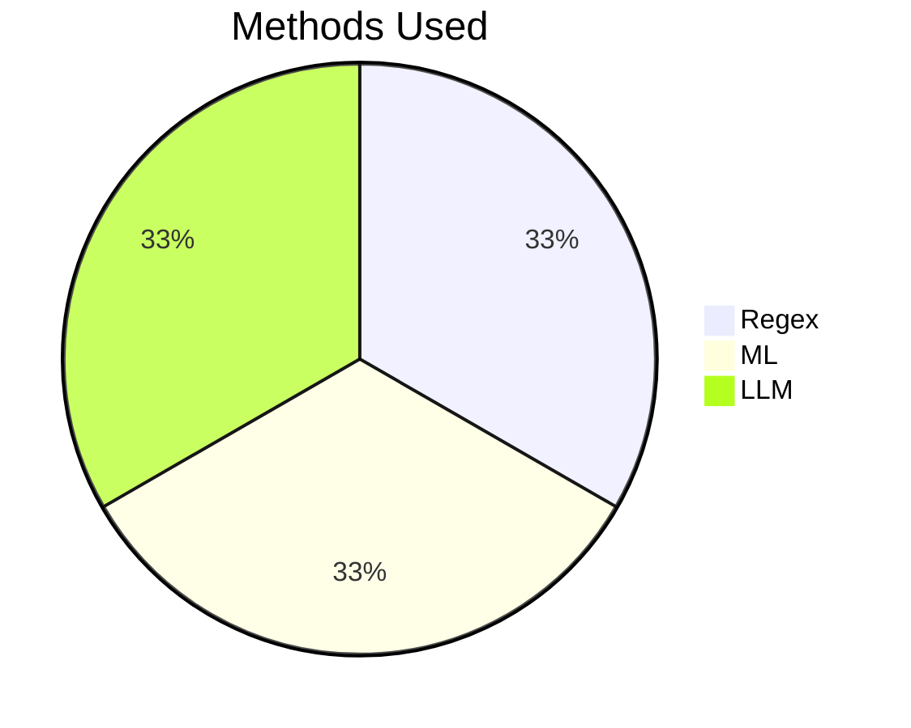
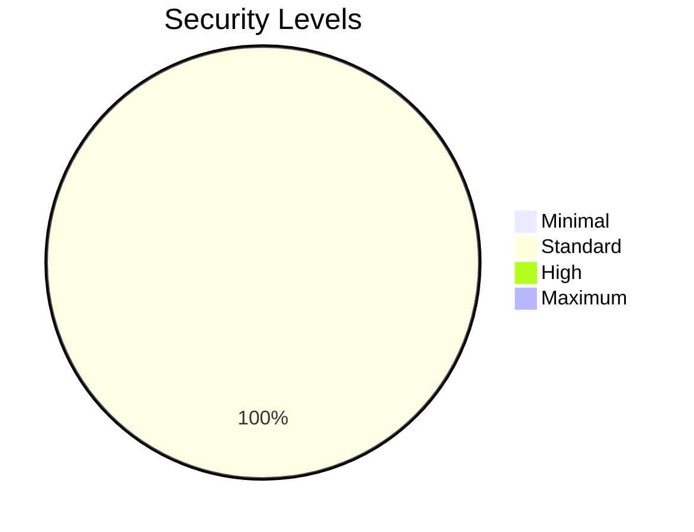
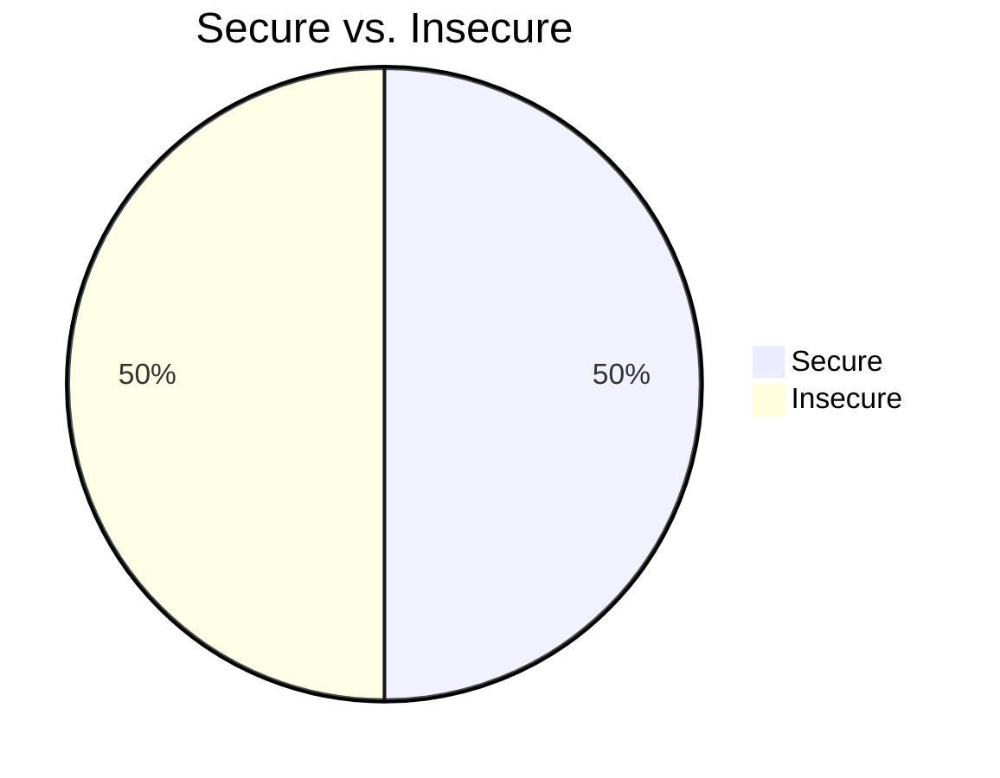

# Security Validation Performance Metrics

## Summary

- Total Validations: 4
- Secure Results: 2 (50.0%)
- Insecure Results: 2 (50.0%)

## Performance Metrics

- Average Total Time: 2895.15 ms
- Average Regex Time: 0.59 ms
- Average ML Time: 1.73 ms
- Average LLM Time: 2892.20 ms

## Methods Used

- Regex: 4 (100.0%)
- ML: 4 (100.0%)
- LLM: 4 (100.0%)

## Security Levels

- Minimal: 0 (0.0%)
- Standard: 4 (100.0%)
- High: 0 (0.0%)
- Maximum: 0 (0.0%)

## Methods Used Chart

## Security Levels Chart

## Secure vs. Insecure Chart

