# Validation Flow Diagram

```mermaid
graph TD
    Input["Input Text"] --> Regex
    Regex["Regex Validator<br>(0.00 ms)"] --> RegexFail["❌ Failed"]

    %% Styling
    classDef input fill:#f9f9f9,stroke:#333,stroke-width:2px;
    classDef validator fill:#e1f5fe,stroke:#0288d1,stroke-width:2px;
    classDef pass fill:#e8f5e9,stroke:#4caf50,stroke-width:2px;
    classDef fail fill:#ffebee,stroke:#f44336,stroke-width:2px;
    class Input input;
    class Regex,ML,LLM validator;
    class RegexPass,MLPass,LLMPass pass;
    class RegexFail,MLFail,LLMFail fail;

```



## Validation Details

- Security Level: unknown
- Validation Method: regex
- Is Secure: False

## Validation Metrics

- Total Time: 0.87 ms
- Methods Used: regex
- Regex Time: 0.00 ms
- ML Time: 0.00 ms
- LLM Time: 0.00 ms

## Complexity Analysis

- Is Complex: True
- Complexity Score: 0.30
- Patterns Detected: indirection, dynamic_code, prompt_manipulation

## Security Issues

- Reason: Critical system command that could harm the system

### Fix Suggestion

```
Use secure file operations instead of system commands
```
